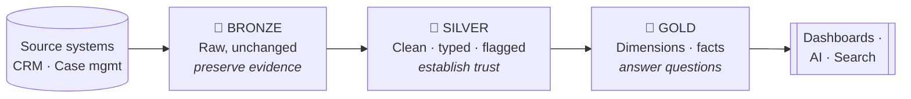
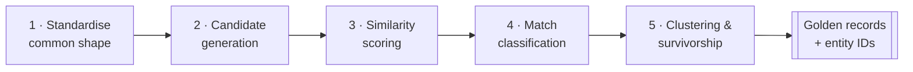

# Introduction

Welcome. This tutorial builds a small but complete data platform from raw source files all the way to trusted dashboards and natural‑language search. It does two things that sit at the heart of almost every real data project:

1. It takes **messy data** through a **Medallion (Lakehouse) architecture** — Bronze, Silver, Gold — so that each source becomes clean, trusted, and ready to use.
2. It performs **Entity Resolution** — working out which records, scattered across different systems, actually describe the *same real‑world person* — without accidentally merging half the organisation into one human.

This document explains **what** those two ideas are and **why** they matter. It deliberately does **not** cover *how* to implement them — that comes next, in the hands‑on tutorial. Think of this as the map you read before the journey.

> **A note on scope.** What follows is a compact proof of concept built on three small, deliberately imperfect datasets. In production — hundreds of tables, millions of records, security reviews, testing and approvals — the same ideas apply, but the build takes rather longer. The goal here is to show that these concepts are not abstract or mysterious. They are concrete, and you can see every decision being made.

---

## The scenario: two systems, no shared truth

Imagine a small organisation running two separate systems.

- **A CRM.** It holds a `customer` table (who the customers are) and a `transaction` table (what they have spent). Those two tables join neatly on a shared customer ID.
- **A case management system.** Completely separate, with its own list of contacts. The records often refer to the same people — but there is **no shared identifier** linking them back to the CRM.

So we have two systems, two versions of the truth, and no reliable way to line them up. That gap is exactly what this tutorial closes, and it gives us two jobs:

| Job | Capability | Purpose |
|-----|------------|---------|
| **Job 1** | Medallion pipeline | Make each source clean, trusted, and ready to use. |
| **Job 2** | Entity resolution | Work out *who is actually who* across the two systems. |

To keep the journey easy to follow, the tutorial tracks two people from start to finish:

- **John Smith** — our well‑behaved customer, who shows how the medallion pipeline works.
- **Nguyen Tran** — our troublemaker, who exists in *both* systems under different names and makes entity resolution work a little harder.

---

## Part 1 — The Medallion Architecture

The medallion architecture organises data into three progressive layers. Each has a different purpose and a different level of trust. One sentence captures the whole idea:

> **Bronze preserves evidence. Silver establishes trust. Gold answers questions.**

### 🥉 Bronze — preserve what arrived

Bronze is the raw ingestion layer. Its only job is to faithfully preserve what the source system delivered. It should **not** be clever: it does not remove duplicates, fix names, guess data types, or silently drop invalid values.

Look at John Smith in Bronze and the problems are all on display:

- **He appears twice** — two identical rows. That duplicate came straight from the source, and Bronze keeps it.
- **Every column is text** — even his date of birth is still just a string.
- **Casing is inconsistent** — his state is written `nsw` in one row and `NSW` in the other. Same value, same person, same system, stored two different ways.

Alongside the business data, the pipeline adds a little **provenance metadata**: when the source created the record, which file it came from (e.g. `customers.csv`), and when the pipeline ingested it. Note that these two timestamps can differ — the CRM might have created a record in 2024, but the pipeline only loaded it in 2026. One describes the *business event*; the other describes the *pipeline event*. Both are worth keeping.

Why preserve all this mess? Because the raw value is **evidence of what the source actually sent**. Consider a customer record with the impossible date *31 February*. If Bronze immediately converted that to `null`, the evidence would be gone. Keeping it means we can:

- **Replay the pipeline later** if our parsing logic changes, a business rule turns out to be wrong, or the source starts sending a new format — all without asking the source to resend anything.
- **Prove exactly what arrived**, which is invaluable for audit and troubleshooting.

Once evidence has been cleaned or corrected, it is no longer truly raw. That is why Bronze changes *nothing*.

### 🥈 Silver — establish trusted source data

Silver is where data becomes clean, typed, and reusable. Here we trim stray spaces, standardise casing, parse dates and timestamps into proper types, convert money into decimals, remove *confirmed* duplicates, validate emails, and check relationships between datasets.

Follow John Smith one layer up and the difference is immediate:

- **One row** — the duplicate has been removed.
- **Standardised state** — now consistently `NSW`.
- **Real dates** — the date fields are proper typed dates, not strings.

But Silver follows a principle that is easy to miss and easy to get wrong:

> **Flag problems — don't delete them.**

Silver adds **quality flags** rather than throwing suspect records away. For customers, two flags appear: is the email valid, and is the date of birth valid. For John, both are `true`. For a customer with a malformed email or an impossible date, those flags become `false` — **but the record stays in the table.**

Why keep bad data at all? Because deleting it destroys a question you will eventually need to answer: *how many bad records did we actually receive?* Flagging keeps that question answerable, lets you build data‑quality reports, and means that if a missing reference arrives later, the related records are still there.

The transaction data shows this vividly. Two records stand out:

- A transaction for **−$50** linked to customer **C999** — which doesn't exist. This single row is broken in *two* ways: a negative sale, and an orphan reference. Silver keeps it, but flags it clearly: `is_valid_amount = false` and `has_known_customer = false`.
- A transaction with **no amount at all**. Kept, and flagged.

Notice the asymmetry with the *duplicate* transaction, though — that one **is** removed in Silver. A **confirmed duplicate is safe to remove; a suspicious value is not.** The transaction table goes from 16 rows to 15 for exactly that reason.

### 🥇 Gold — prepare data for consumption

Gold is where data becomes ready for a specific business purpose: dimensions, fact tables, aggregations, metrics, features for ML, and datasets shaped for dashboards and AI tools. Gold is allowed to make **stronger decisions** than Silver.

In the customer dimension, John appears as the business sees him:

- His first and last names are combined into a friendly **display name**.
- An **age band** (e.g. *30–49*) is derived from his date of birth — a value that never existed in the source, created to make reporting easier. (Customers with an invalid date fall into a safe **"unknown"** band rather than vanishing.)
- The technical scaffolding — source file, ingestion timestamp, quality flags — is **gone**. It did its job in Bronze and Silver; it doesn't belong in the table analysts consume.

The fact table then consolidates John's individual transactions into totals grouped by month and channel. And here is the payoff — a small proof that the architecture is working. Totalling the transaction data three ways:

| Total | What it includes | Result |
|-------|------------------|--------|
| Valid Silver | Only transactions Silver flagged as valid | **$4,867** |
| Gold | The trusted consumption layer | **$4,867** ✅ |
| Raw Silver | *Every* transaction, including the invalid ones | **$4,817** ❌ |

Gold and valid‑Silver agree **to the cent** — proof that "which transactions are trusted" is decided **once**, on the way into Gold, not re‑implemented differently inside every dashboard.

The surprising line is the raw total. Including *more* records produces a *smaller* number — because that −$50 orphan transaction quietly drags the naive total down. So the raw total isn't just untidy, it's **wrong**. Gold identifies the row as invalid (negative amount *and* non‑existent customer), excludes it from the answer, and reports the genuinely trusted figure. Crucially, the bad row hasn't disappeared — it's still sitting in Silver, clearly flagged, available for audit.

Follow that one row through all three layers and you have the whole architecture in miniature:

> **Bronze preserves it. Silver evaluates it. Gold acts on it.**

### Why three layers?

For a tiny one‑off analysis, loading a file, cleaning it, and building a report in one step is fine. But as a platform grows, four problems appear: the original data gets lost during cleansing; every consumer reinvents its own cleaning rules; business logic accumulates inside dashboards; and when something breaks, nobody can tell where the error was introduced.

The layers give you **separation of responsibility** — Bronze tells you what arrived, Silver tells you what the trusted record looks like, Gold tells you what's ready to consume. And they enforce one governing principle:

> **Discard information as late as possible, do it visibly, and do it in exactly one controlled place — never silently, and never somewhere it cannot be recovered.**

---

## Part 2 — Entity Resolution

The medallion pipeline makes each source *trustworthy*. But it can't answer a question that spans systems: **is this person in the CRM the same person as this contact in the case system?** They have different IDs, the names aren't identical, and there's no shared key. Entity resolution decides whether records from different systems refer to the same real‑world entity — here, a person — using the available evidence.

Most entity resolution follows five stages:

### 1 · Standardisation

Different systems write the same person differently — different name order, punctuation, middle names. Before comparing, we bring everything into one common shape: uppercase the name, remove punctuation, split it into words, **sort the words alphabetically**, and join them back.

Take Nguyen Tran. The CRM records the name one way; the case system reverses the order *and* includes a middle name. Token‑sorting pulls them much closer together — but note the honest detail: they still aren't *identical*, because one record has an extra middle‑name token. Standardisation reduces the difference; it doesn't erase it. That's why we can't simply join on "names are equal" — we have to **measure similarity** and combine it with other evidence.

### 2 · Candidate generation

Comparing every record against every other record doesn't scale — a million rows against a million rows is a *trillion* comparisons. Candidate generation narrows the field: two records only become a candidate pair if they already share some basic evidence — the same email, the same date of birth, or a similar‑*sounding* name (using a phonetic code, so that names that sound alike are nominated as possibilities). Being a candidate doesn't mean "match" — only "worth comparing carefully."

### 3 · Similarity scoring

For each candidate pair we compute a **name similarity score** between 0 and 1, based on how many single‑character edits turn one name into the other. A score of 1 means identical; lower means more edits are needed. This score is *one* piece of evidence — never the whole decision.

### 4 · Match classification

The score is then combined with **stronger evidence** using deterministic, human‑readable rules. The magic isn't in any single number — it's in requiring *independent corroboration*. Three worked examples make the philosophy click:

| Pair | Name score | Supporting evidence | Decision |
|------|-----------|---------------------|----------|
| **Nguyen Tran** (CRM) vs Nguyen Tran (case) | 0.733 | Dates of birth match (Nov 1978) | ✅ **Match** — DOB + fuzzy name |
| **John Smith** vs **J. Smith** | 0.70 | Case‑system date of birth is **null** | ❌ **No match** — no corroboration |
| **Alice Brown** vs **Alicia Braun** | 0.667 | Dates of birth differ | ❌ **No match** — different people |

The J. Smith case is the important one. Its name score (0.70) is practically neck‑and‑neck with the Nguyen Tran match (0.733) — yet it is deliberately classified as **no match**, because there's no second piece of evidence to confirm it. The rule is intentionally conservative: *a fuzzy name alone is not enough; a matching date of birth must support it.* Effectively the system says: *"You may be the same John Smith, but I cannot prove it — and I'm not going to guess."*

That restraint is not a weakness. It is the entire point. A system chasing the highest similarity score will eventually merge two different people; a system asking *"do I have enough independent evidence to be confident?"* will not.

Every pair it considers — matched or not, and *why* — is recorded in an auditable scored‑pairs table. The decision is explainable.

### 5 · Clustering and survivorship — the golden record

Once we know which pairs match, we assign their source records to a shared **entity ID** — an identifier that *did not exist before*, because the two systems never shared a key. Then we build one **golden record** per resolved person.

The golden record doesn't pick one value and bin the rest. It **brings together everything we currently know**: it may prefer the CRM name for display, but it retains *both* email addresses (one from each system), preserves the originating source IDs so the entity stays traceable, and records how many source records were combined. For Nguyen Tran, the two systems' differing versions finally sit side by side in one reconciled, auditable record — with a record count of two.

---

## How the two ideas fit together

Here is the insight that ties the whole tutorial together.

Before entity resolution, a spending dashboard built purely on the CRM might show Nguyen Tran as the top customer with, say, $1,610 of spend. That number isn't *wrong* — it's the genuine total for that CRM account, nothing double‑counted. But it is **incomplete**. The dashboard answers *"how much did this account spend?"* when the business really wants *"what do we know about this person across every system we hold?"* Anything known only to the case system is invisible.

In the real world this gets worse: the same person can hold *two* accounts, each with its own transactions. A dashboard grouped by account splits one person's spend across two rows, understates their true value, and leaves the organisation with no reliable single view of the customer.

Entity resolution fixes this. Rebuild the same dashboard on the **entity ID** instead of the account ID and the visuals don't change — but the meaning quietly improves, from **spending per account** to **spending per person**. Connect a third system tomorrow and its records fold into the same entities automatically, with no report to redesign.

And this only works *because* the matching is conservative. Had the system over‑merged — absorbing J. Smith into John Smith, or Alice Brown into Alicia Braun — a person‑level dashboard would start combining transactions from **completely different people**, which is worse than the account‑level view it replaced. The restraint we saw in stage 4 is what makes person‑level analytics safe enough to trust.

> The medallion pipeline gives you a *trusted dashboard*. Entity resolution gives that dashboard a *definition of "customer" it can finally rely on*. Together they turn a clean data pipeline into something the organisation can genuinely reason with.

---

## The technology (in brief)

The hands‑on tutorial implements all of this on **Azure Databricks** using **PySpark**, with **Unity Catalog** for governance and **Azure Data Lake Storage (ADLS) Gen2** for storage. The gold data is then surfaced through an **AI/BI dashboard**, an **interactive entity‑search dashboard**, and **Databricks Genie** for natural‑language questions. You don't need any of those details yet — they're here only so you know where we're heading.

---

## What's next

Now that the two ideas are clear — *preserve, trust, answer* for the medallion architecture, and *standardise, compare, corroborate, resolve* for entity resolution — the next document rolls up its sleeves and **builds them**, step by step: the environment, the governed lakehouse, the full Bronze → Silver → Gold pipeline, the explainable entity‑resolution process, and the dashboards and natural‑language search on top.

See you in the build. 🚀
