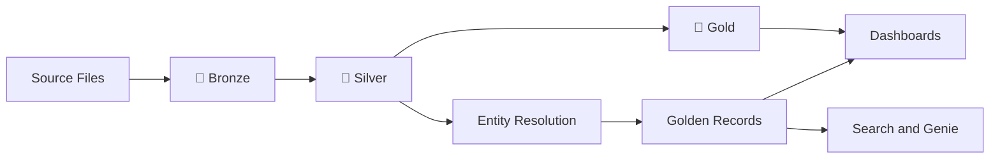

# Databricks Medallion Lakehouse and Entity Resolution

A hands-on tutorial for building a **Medallion Lakehouse** and an **Entity Resolution** solution with Databricks.

This project starts with messy data from separate systems and turns it into trusted analytics, resolved customer records, interactive dashboards and natural-language search.

## What You Will Build

You will build two connected capabilities:

### 🥉🥈🥇 Medallion Lakehouse

Move raw data through three trusted layers:

* **Bronze** preserves exactly what arrived.
* **Silver** cleans, standardises and validates the data.
* **Gold** creates trusted datasets for dashboards and analytics.

> **Bronze preserves evidence. Silver establishes trust. Gold answers questions.**

### 🔍 Entity Resolution

Identify records from different systems that belong to the same real-world person, even when:

* Names are spelled differently
* Name order changes
* Values are missing
* Systems use different identifiers

The matching process is deliberately conservative. A similar name alone is not enough—the solution looks for supporting evidence before combining records.

## The Scenario

The tutorial uses three small synthetic datasets:

* CRM customers
* CRM transactions
* Case-management contacts

The CRM and case-management system contain some of the same people, but they do not share a common identifier.

The tutorial shows how to clean each source, compare records, assign shared entity IDs and create a trusted golden record.

## Architecture



## Technology

This tutorial uses:

* Azure Databricks
* PySpark
* Delta Lake
* Unity Catalog
* Azure Data Lake Storage Gen2
* Databricks AI/BI Dashboards
* Databricks Genie

## Tutorial Structure

1. Introduction and architecture
2. Azure and Databricks setup
3. Unity Catalog and governed storage
4. Bronze ingestion
5. Silver cleansing and data quality
6. Gold dimensions and fact tables
7. Entity standardisation
8. Candidate generation and similarity scoring
9. Match classification and clustering
10. Golden records, dashboards and search

## Repository Structure

```text
docs/          Step-by-step tutorial
data/          Synthetic sample datasets
src/           Reusable source code
```

## Getting Started

Begin with the tutorial introduction:

[Read the introduction](docs/01-introduction.md)

Then follow the lessons in order and run the matching notebooks in Databricks.

* Part 1: [medallion-lakehouse](./docs/02-medallion-lakehouse.md)

* Part 2: [entity-resolution](./docs/03-entity-resolution.md)

* Tutorial video 1: [Build Medallion Lakehouse and Entity Resolution](https://img.youtube.com/vi/sBmYFvtvILM/maxresdefault.jpg)

<a href="https://www.youtube.com/watch?v=sBmYFvtvILM">
  
</a>

* Tutorial video 2: [RECAP Medallion Lakehouse and Entity Resolution 2](https://www.youtube.com/watch?v=I2KTkrbMfZ0)

<a href="https://www.youtube.com/watch?v=I2KTkrbMfZ0">
  
</a>

## Scope

This project is a compact proof of concept designed to make the architecture easy to understand.

A production implementation would require additional work around security, incremental ingestion, monitoring, testing, performance, human review and operational governance.

## Sample Data

All [data](./data/) included in this repository is synthetic and created solely for demonstration purposes.

## Licence

This project is available under the [MIT License](LICENSE).

---

Messy files go in. Trusted people-level insights come out. 🚀
