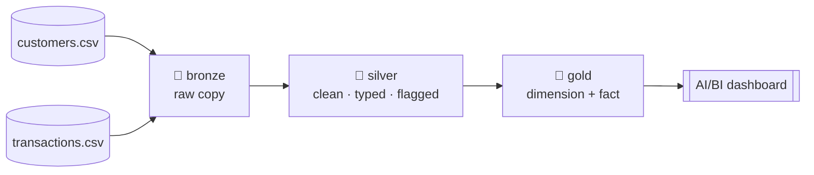

# Part 1 — Build a Medallion Lakehouse on Azure Databricks

Welcome! This is the first of a two-part, hands-on tutorial. Here in Part 1 you'll take two messy CSV files and turn them into clean, trusted, business-ready tables using the **medallion architecture** — bronze, silver, and gold. In [Part 2](./03-entity-resolution.md), you'll add a third source and learn **entity resolution**: how to work out when records from different systems describe the same real person.

New to the *why* behind all this? Read [`introduction`](./01-introduction.md) first — it explains the ideas gently, and this tutorial builds on them. If you'd rather just start building, that's fine too; we'll recap the essentials as we go.

Throughout, we'll follow one friendly customer — **John Smith** — so you can see exactly what happens to a single record at each layer.

---

## What you'll build in Part 1

A three-layer pipeline over two source tables (`customers` and `transactions`):



By the end you'll have a governed lakehouse, a full bronze → silver → gold pipeline, and a dashboard sitting on top of trusted data.

---

## Before you start

You'll need:

- An **Azure subscription** where you can create resources (Step 0 walks through everything).
- Databricks compute on **DBR 14.3 LTS or later** — we use a few handy functions (`try_to_date`, `try_to_timestamp`, `try_cast`) that need it. **Note: serverless compute is good enough.**
- Three sample files: `customers.csv`, `transactions.csv` and `contactss.csv`. Find them in [`data`](../data)

We'll write in **PySpark** (the DataFrame API), dropping into SQL only where the platform needs it — a little setup and the dashboard query.

---

## A quick refresher: what the three layers are for

You can sum up the whole architecture in one sentence:

> **Bronze preserves evidence. Silver establishes trust. Gold answers questions.**

Here's what that means in practice:

| Layer | What it promises | What it deliberately leaves alone |
|---|---|---|
| 🥉 **Bronze** | A faithful copy of the source, plus a note of where each row came from and when. | It doesn't interpret, type, deduplicate, filter, or fix *anything*. |
| 🥈 **Silver** | One clean, correctly-typed, deduplicated version of each source. Problems get *flagged*, not deleted. | It doesn't aggregate or reshape data for any particular report. |
| 🥇 **Gold** | Tables shaped for real business questions, containing only valid data. | It doesn't keep invalid rows or act as an archive. |

One golden rule runs through everything: **silver flags problems; only gold removes them.** We throw away information as late as possible, as visibly as possible, and in exactly one place — never quietly, never somewhere we can't get it back. You'll see why this matters as we go.

---

## Meet the sample data

Our two files are small and deliberately imperfect. Every flaw is there on purpose, so you get to practise handling the kinds of mess that real data throws at you.

**`customers.csv` — a CRM export, 11 rows.** It contains an exact duplicate row (John Smith appears twice), two different date formats mixed together, an impossible date (`31/02/2001`), an email with no proper domain (`peter.wong@mail`), a missing email, and inconsistent spacing and capitalisation throughout.

**`transactions.csv` — a payments export, 16 rows.** It has a duplicate transaction, a transaction pointing at a customer (`C999`) who doesn't exist, a negative amount, an empty amount, mixed date formats again, and inconsistent casing in the channel and currency fields (`BRANCH`, `aud`, `Mobile`).

Don't worry about memorising these — we'll call them out as each transformation deals with them.

---

## Step 0 — Set up your Azure environment

This is the one-time plumbing. The goal is a Databricks workspace that can securely read and write a data lake — with **no passwords or secrets stored anywhere**. Here's what we're creating and why:

| Resource | What it's for |
|---|---|
| Resource group | A single container that holds everything, so you can delete it all in one go later |
| Databricks workspace | Your compute, notebooks, catalog, and dashboards (needs the **Premium** tier for Unity Catalog) |
| ADLS Gen2 storage account | The actual data lake (**hierarchical namespace must be ON** — this can't be enabled later) |
| Container | A folder in that storage account for your landing files |
| Access Connector | A managed identity that lets Databricks reach the storage — no keys involved |
| Role assignment | Grants that identity permission on the storage account |

### 0.1 Create the Azure resources

You can click through the Azure Portal, but a script is faster and repeatable. Run this from a terminal with the Azure CLI (`az login` first):

```bash
# Variables
LOC=australiaeast
RG=rg-poc-lakehouse
DBW=dbw-poc-lakehouse
SA=stpoclakehouse            # must be globally unique
CONN=dbac-poc-lakehouse

# 1. Resource group
az group create --name $RG --location $LOC

# 2. Databricks workspace (Premium for Unity Catalog)
az databricks workspace create --resource-group $RG --name $DBW \
  --location $LOC --sku premium

# 3. ADLS Gen2 storage account (hierarchical namespace = --hns)
az storage account create --resource-group $RG --name $SA \
  --location $LOC --sku Standard_LRS --kind StorageV2 --hns true

# 4. Container
az storage container create --account-name $SA --name poc-landing \
  --auth-mode login

# 5. Access Connector (creates a system-assigned managed identity)
az databricks access-connector create --resource-group $RG --name $CONN \
  --location $LOC --identity-type SystemAssigned

# 6a. Wait until the connector's managed identity is ready
echo "Waiting for the access connector's managed identity to be ready..."
PRINCIPAL_ID=""
for i in {1..12}; do
  PRINCIPAL_ID=$(az databricks access-connector show \
    --resource-group $RG --name $CONN --query identity.principalId -o tsv)
  if [ -n "$PRINCIPAL_ID" ]; then
    echo "Got principalId: $PRINCIPAL_ID"; break
  fi
  echo "  not ready yet, retrying in 10s ($i/12)..."; sleep 10
done
if [ -z "$PRINCIPAL_ID" ]; then
  echo "ERROR: principalId never became available. Aborting." >&2; exit 1
fi

SA_ID=$(az storage account show --resource-group $RG --name $SA --query id -o tsv)

# 6b. Grant the role (retry, in case identity replication is catching up)
echo "Assigning Storage Blob Data Contributor..."
for i in {1..6}; do
  if az role assignment create \
      --assignee-object-id $PRINCIPAL_ID \
      --assignee-principal-type ServicePrincipal \
      --role "Storage Blob Data Contributor" --scope $SA_ID; then
    echo "Role assigned."; break
  fi
  echo "  failed (likely propagation), retrying in 15s ($i/6)..."; sleep 15
done

# Keep this output — you'll paste it into Databricks next:
echo "Access connector Resource ID:"
az databricks access-connector show --resource-group $RG --name $CONN \
  --query id -o tsv
```

*(On older CLI versions, run `az extension add --name databricks` first.)*

Why go to the trouble of a managed identity? Because it means **there's no secret to store, leak, or rotate**. Databricks borrows this identity to reach the lake, and access is just a normal, visible Azure permission you can grant or revoke instantly. It's the clean, modern way to connect — well worth learning early.

### 0.2 Connect Unity Catalog to your storage

Three small objects in Databricks link your catalog to the storage you just created. In the workspace UI:

1. **Storage credential.** Catalog → External data → Credentials → Create → type *Azure Managed Identity*, name it `cred_poc`, and paste the access connector's **Resource ID** (the value the script printed at the end).
2. **External location.** Catalog → External data → External locations → Create → name `loc_poc_landing`, URL `abfss://poc-landing@stpoclakehouse.dfs.core.windows.net/`, credential `cred_poc` → then click **Test connection**. This needs to pass before anything else works. If it fails, it's almost always the role assignment from Step 0.1 still propagating — wait a couple of minutes and try again.
3. **Catalog, schemas, and volume.** Open a Python notebook and run:

```python
spark.sql("CREATE CATALOG IF NOT EXISTS poc MANAGED LOCATION 'abfss://poc-landing@stpoclakehouse.dfs.core.windows.net/managed/poc'")
for schema in ["bronze", "silver", "gold"]:
    spark.sql(f"CREATE SCHEMA IF NOT EXISTS poc.{schema}")

spark.sql("""
CREATE EXTERNAL VOLUME IF NOT EXISTS poc.bronze.landing
LOCATION 'abfss://poc-landing@stpoclakehouse.dfs.core.windows.net/landing'
""")
```

A nice way to remember what those three objects do: the **credential** is *who we are* to Azure, the **external location** is *which paths that identity is allowed to use*, and the **volume** is the friendly, path-like address (`/Volumes/poc/bronze/landing/`) your notebooks will actually read from. Creating one schema per layer (bronze, silver, gold) also means the architecture shows up right there in your catalog tree — easy to see, easy to govern.

### 0.3 Upload the files

In the UI: Catalog → poc → bronze → landing → **Upload to volume**, and add `customers.csv` ,  `transactions.csv` and `contacts.csv`

You can check they arrived with:

```python
display(dbutils.fs.ls("/Volumes/poc/bronze/landing"))
```

### 0.4 Pick your compute

Use **serverless** notebook compute — it's the simplest option and more than enough for this tutorial. No cluster to configure or remember to shut down.

### 0.5 One shared setup cell

Put this at the top of your notebook so the imports and landing path are ready for every step:

```python
from pyspark.sql import functions as F
from pyspark.sql.window import Window

LANDING = "/Volumes/poc/bronze/landing"
```

> **When you're finished with the whole tutorial:** `az group delete --name rg-poc-lakehouse` removes every Azure resource in one command.

---

## Step 1 — Bronze: bring the data in, untouched

Bronze has one job: make a faithful copy of what the source sent, and record where it came from. Nothing more.

```python
def ingest_bronze(file_name: str, target_table: str):
    df = (
        spark.read.format("csv")
        .option("header", True)
        .option("inferSchema", False)          # everything stays as text
        .load(f"{LANDING}/{file_name}")
        .withColumn("_source_file", F.col("_metadata.file_name"))
        .withColumn("_ingested_at", F.current_timestamp())
    )
    df.write.mode("overwrite").saveAsTable(target_table)
    return df

ingest_bronze("customers.csv",    "poc.bronze.customers_raw")
ingest_bronze("transactions.csv", "poc.bronze.transactions_raw")
```

Let's unpack the choices, because each one is teaching a habit:

- **`inferSchema=False` keeps every column as text.** If we let Spark guess types, it would quietly make decisions for us — is `12/07/1990` in July or December? — and, worse, an unreadable value could become NULL the moment it lands, erasing the evidence of what the source actually sent. Because we keep everything as text, John Smith's duplicate row and that impossible date `31/02/2001` both arrive perfectly intact. We'll deal with them later, on our own terms.
- **`_source_file` and `_ingested_at`** are our breadcrumbs. For any row, we can always answer "which file brought this in, and when?" — usually the very first thing you want to know when something looks off.
- **No deduplication.** The duplicate row is *information* — the source sent it twice, and that's a fact worth keeping. Bronze records it; silver will decide what to do about it.
- **`overwrite` mode** keeps this tutorial simple to re-run. (In a real system, bronze usually keeps appending so history builds up over time.)

That's it — bronze is meant to be boring. Its restraint is exactly the point.

---

## Step 2 — Silver: clean it up, and flag what's wrong

Now the data becomes trustworthy: trimmed, correctly typed, deduplicated, and with clear flags on anything suspect.

### 2.1 A little helper for dates

Our dates come in more than one format, so let's write a small parser we can reuse:

```python
def parse_date(col_name: str):
    """Try ISO first, then Australian d/m/y. Anything invalid (e.g. 31 Feb) becomes NULL."""
    return F.coalesce(
        F.try_to_date(F.col(col_name), F.lit("yyyy-MM-dd")),
        F.try_to_date(F.col(col_name), F.lit("dd/MM/yyyy")),
    )
```

`try_to_date` quietly returns NULL when a value doesn't fit, rather than crashing — so we can try formats in order of confidence. We try ISO first because it's unambiguous, then the Australian `dd/MM/yyyy` because that's what this source uses. **The order genuinely matters:** if you throw in too many formats, a value like `03/04` could parse "successfully" as two different dates depending on which pattern wins. And that impossible `31/02/2001`? It fits neither format, so it becomes NULL — which is honestly the right answer for "this isn't a real date." We'll make that visible with a flag in a moment.

### 2.2 Clean up the customers

```python
typed = (
    spark.table("poc.bronze.customers_raw")
    .select(
        F.upper(F.trim("customer_id")).alias("customer_id"),
        F.initcap(F.trim("first_name")).alias("first_name"),
        F.initcap(F.trim("last_name")).alias("last_name"),
        parse_date("dob").alias("dob"),
        F.lower(F.trim("email")).alias("email"),
        F.upper(F.trim("state")).alias("state"),
        F.try_to_timestamp(F.col("created_at")).alias("created_at"),
        "_source_file", "_ingested_at",
    )
)

w = Window.partitionBy("customer_id").orderBy(
    F.col("created_at").desc(), F.col("_ingested_at").desc()
)

silver_customers = (
    typed
    .withColumn("rn", F.row_number().over(w))
    .where("rn = 1")
    .drop("rn")
    .withColumn("is_valid_email",
                F.col("email").isNotNull()
                & F.col("email").rlike(r"^[^@]+@[^@]+\.[^@]+$"))
    .withColumn("has_valid_dob", F.col("dob").isNotNull())
)

silver_customers.write.mode("overwrite").saveAsTable("poc.silver.customers")
```

Here's what each bit of cleaning is doing, and why it earns its place:

| We do this | To fix this | Because otherwise… |
|---|---|---|
| `trim` everywhere | `"  Mary "` | Stray spaces silently break joins and grouping |
| `upper` on IDs and codes | `nsw` vs `NSW` | Keys and categories need one canonical form |
| `initcap` on names | `alice brown`, `JONES` | Consistent display, and tidy input for Part 2 |
| `lower` on email | `Mary.Jones@Mail.com` | Emails are case-insensitive; a canonical form lets us match them later |
| `parse_date` | mixed formats, 31 Feb | Real dates let us calculate ages and group by month |
| email regex → a **flag** | `peter.wong@mail` | We *flag* rather than delete — the value might still be useful, but we shouldn't trust it as an identifier |

**About the deduplication:** we use `row_number()` over a window grouped by the business key (`customer_id`) and ordered by recency, then keep only the first row. In plain terms: *for each customer, keep the most recent version.* John Smith's duplicate collapses into a single, clean record — and if two rows ever tied, `row_number` still guarantees exactly one survivor.

Notice the pattern with the flags: `is_valid_email` and `has_valid_dob` don't remove anything. The dodgy email and the impossible birthday stay in the table, clearly labelled. That way we can always answer "how many bad records did we receive, and which ones?" — a question you lose forever the moment you delete them.

### 2.3 Clean up the transactions

```python
typed_txn = (
    spark.table("poc.bronze.transactions_raw")
    .select(
        F.upper(F.trim("txn_id")).alias("txn_id"),
        F.upper(F.trim("customer_id")).alias("customer_id"),
        parse_date("txn_date").alias("txn_date"),
        F.col("amount").try_cast("decimal(12,2)").alias("amount"),
        F.upper(F.trim("currency")).alias("currency"),
        F.lower(F.trim("channel")).alias("channel"),   # tidy to: online | branch | mobile
        "_source_file", "_ingested_at",
    )
)

w_txn = Window.partitionBy("txn_id").orderBy(F.col("_ingested_at").desc())
known_customers = spark.table("poc.silver.customers").select("customer_id")

silver_txns = (
    typed_txn
    .withColumn("rn", F.row_number().over(w_txn))
    .where("rn = 1").drop("rn")
    .join(known_customers.withColumn("_known", F.lit(True)), "customer_id", "left")
    .withColumn("has_known_customer", F.coalesce("_known", F.lit(False)))
    .drop("_known")
    .withColumn("is_valid_amount",
                F.col("amount").isNotNull() & (F.col("amount") > 0))
)

silver_txns.write.mode("overwrite").saveAsTable("poc.silver.transactions")
```

A few new ideas appear here:

- **`try_cast("decimal(12,2)")` for money.** This does two things: `try_cast` turns an unreadable amount into NULL instead of crashing the job (handling that empty amount), and using **decimal rather than float** keeps money exact — floats can't represent most decimal fractions precisely, and those tiny errors add up in financial totals.
- **A controlled vocabulary for `channel`.** It arrives as `online`, `BRANCH`, `Mobile`; lowercasing collapses it to three clean values. Skip this and you'd later get six channel groups instead of three — a subtle bug that's easy to miss.
- **Referential integrity as a flag.** A left join against the *silver* customers marks that orphan transaction (customer `C999`) with `has_known_customer = False`. We check against silver, not bronze, because "does this customer exist?" only means something against our trusted, deduplicated list.
- **Business validity as a flag.** `is_valid_amount` captures the rule "an amount must be present and positive." Whether that rule is exactly right — should refunds be negative? — is a business conversation, which is precisely why it lives as a named, visible flag rather than being hidden inside a filter.

Same philosophy as before: the orphan and the empty-amount rows stay put, clearly labelled. We're preserving and flagging, not deleting.

---

## Step 3 — Gold: shape it for real questions

Gold is where you get to make deliberate, opinionated choices about how the data will be *used*. We'll build two classic shapes: a **dimension** (a tidy description of customers) and a **fact** (numbers to measure, pre-summarised).

### 3.1 A customer dimension

```python
age_years = F.floor(F.datediff(F.current_date(), F.col("dob")) / 365.25)

dim_customer = (
    spark.table("poc.silver.customers")
    .select(
        "customer_id",
        F.concat_ws(" ", "first_name", "last_name").alias("customer_name"),
        "dob",
        F.when(F.col("dob").isNull(), "Unknown")
         .when(age_years < 30, "Under 30")
         .when(age_years < 50, "30–49")
         .otherwise("50+").alias("age_band"),
        "state",
        F.when(F.col("is_valid_email"), F.col("email")).alias("email"),
    )
)
dim_customer.write.mode("overwrite").saveAsTable("poc.gold.dim_customer")
```

Each choice here is a small lesson in curation:

- **Friendly, business-named fields, computed once.** `customer_name` and `age_band` are worked out *here*, not in every dashboard. If the business later redefines the age bands, you change one line and every report updates together.
- **`age_band` handles the missing birthday gracefully** as `"Unknown"` — so that customer with the invalid date becomes a sensible category rather than an error or a silent disappearance. Quality issues stay visible, just in a form business users can read.
- **Invalid emails are withheld.** Notice the shift from silver: silver *flagged and kept* the bad email; gold simply *doesn't expose* it. Gold consumers should only ever see values the pipeline is happy to stand behind.
- **The engineering flags are dropped.** They did their job upstream; a dashboard author doesn't need to see them.

### 3.2 A monthly-spend fact table

```python
fct_monthly_spend = (
    spark.table("poc.silver.transactions")
    .where("has_known_customer AND is_valid_amount AND txn_date IS NOT NULL")
    .groupBy("customer_id",
             F.date_trunc("month", "txn_date").alias("txn_month"),
             "channel")
    .agg(F.count("*").alias("txn_count"),
         F.sum("amount").alias("total_spend"))
)
fct_monthly_spend.write.mode("overwrite").saveAsTable("poc.gold.fct_monthly_spend")
```

- **This `where` clause is the one and only place we remove invalid rows.** The orphan transaction and the empty-amount row drop out *right here* — nowhere else in the whole pipeline. Everything upstream carefully preserved and flagged them, and we let go of them at the very last moment, in a single line you can read at a glance.
- **The grain is a promise.** Each row means one `customer × month × channel`. Deciding the grain up front is the most important step in designing a fact table — it tells everyone exactly what a row represents. We chose this grain to match the questions the dashboard will ask (spending over time, by channel, by customer).
- **Pre-summarising is a kindness to whatever comes next** — faster dashboards, and one shared definition of "monthly spend" that everybody inherits.

If you're curious what got filtered out, the rejected rows are still sitting safely in silver, ready to inspect:

```python
display(spark.table("poc.silver.transactions")
        .where("NOT (has_known_customer AND is_valid_amount)"))
```

That's the beauty of flag-don't-delete: gold stays clean, and nothing is ever truly lost.

---

## Step 4 — Put a dashboard on top

Dashboards read from SQL datasets, so this is the one spot in Part 1 where we use a little SQL.

1. Left nav → **Dashboards → Create dashboard**.
2. On the **Data** tab → **Create from SQL**:

```sql
SELECT d.customer_name, d.state, d.age_band,
       f.txn_month, f.channel, f.txn_count, f.total_spend
FROM poc.gold.fct_monthly_spend f
JOIN poc.gold.dim_customer d USING (customer_id)
```

3. On the **Canvas** tab, add a few widgets (Databricks can even suggest them for you): total spend by state, spend over time split by channel, a table of customers ranked by spend, and a filter on state or age band.
4. **Publish.**

Take a look at that query — it's a *plain join*. No CASE statements, no cleanup, no filtering. That's the reward for all the work upstream: because every business rule already lives in your pipeline code, the dashboard's only job is to arrange the picture. It's also what makes this data a great fit for AI tools like Databricks Genie — natural-language questions work well precisely *because* the tables beneath are clean, clearly named, and already modelled.

---

## What you've built — and what's next

Starting from two messy files, you now have a governed lakehouse and a complete bronze → silver → gold pipeline: raw evidence preserved in bronze, trusted and clearly-flagged records in silver, and consumption-ready tables feeding a dashboard in gold. Along the way you practised the habit that matters most — **keep quality visible, and let go of information late, once, and out in the open.**

In [Part 2](./03-entity-resolution.md), we bring in a third system that describes some of the same people under different names, and learn how to figure out **who is actually who** — turning scattered records into single, trustworthy golden entities. See you there!
