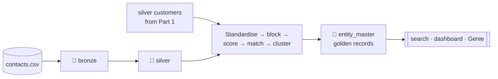

# Part 2 — Entity Resolution on Azure Databricks

Welcome back! In [Part 1](./02-medallion-lakehouse.md) you built a medallion pipeline that turned messy files into clean, trusted tables. That gave you a dependable view of one system — the CRM.

But real organisations run *several* systems, and the same person often shows up in more than one of them, recorded slightly differently each time. There's usually no shared ID linking those records together. **Entity resolution** is how we figure out which records describe the same real person and stitch them into a single, reliable view.

In this part we'll add a third source — a case-management system — and build a small, explainable entity-resolution pipeline on top of everything from Part 1. Our guide this time is **Nguyen Tran**, who appears in *both* the CRM and the case system under different names, and who will show us exactly why this is harder than a simple join.

If you'd like the gentle conceptual tour before diving in, [`Introduction`](./01-introduction.md) covers it. Otherwise, we'll recap what you need as we go.

---

## What you'll build in Part 2



You'll ingest the new source through the same three layers, resolve people across the two systems into **golden records**, and make the result easy to use through a search function, a dashboard search box, and a natural-language Genie space.

---

## A quick refresher: the five stages of entity resolution

Almost every entity-resolution system — from a tiny tutorial like this to a big enterprise platform — follows the same five stages. We'll build one step at a time:

| Stage | The question it answers | How we'll do it |
|---|---|---|
| 1 · **Standardise** | Can we get every record into the same shape? | A shared person table, with names cleaned and tokens sorted |
| 2 · **Generate candidates** | Which pairs are even worth comparing? | Only compare records that share an email, a birthday, or a similar-sounding name |
| 3 · **Score similarity** | How alike are two names, really? | A normalised edit-distance score between 0 and 1 |
| 4 · **Classify the match** | Same person, not sure, or different people? | A few clear, ordered rules |
| 5 · **Cluster & merge** | How do we build one record per person? | Group matched records and combine their best values |

Two ideas are worth holding onto throughout, because they shape every decision:

- **A wrong merge is worse than a missed one.** Fusing two different people into one entity is hard to spot and hard to undo, and it wrongly blends their histories. So when in doubt, we *don't* merge.
- **Missing information is never a match.** If two records both lack a birthday, that's *no evidence*, not *matching evidence*. Every rule we write insists on real, present data.

---

## Meet the third data source

**`contacts.csv` — a case-management system, 8 rows.** These records overlap with the CRM customers from Part 1, but there's no shared key, and the names are written differently. Here's the cast, and what each one is here to teach you:

| Contact | How it relates to the CRM | What it teaches |
|---|---|---|
| CT01 Jon Smith | Same person as C001 John Smith (same email + birthday) | An exact email match |
| CT02 Maria Jones (no email) | Same as C002 Mary Jones | Matching on birthday + a similar name |
| CT03 Tran Van Nguyen | Same as C003 Nguyen Tran | Why sorting name words matters |
| CT04 Alicia Braun | A *decoy* — sounds like C005 Alice Brown, but a different birthday | Why "sounds similar" isn't enough |
| CT05 J. Smith (no birthday) | *Might* be C001 — but we can't be sure | Choosing not to merge when evidence is thin |
| CT06 Emma Wilson | Identical to C009 | The easy case |
| CT07 David Li | Same as C006 David Lee (same email) | Email beating a spelling difference |
| CT08 Robert King | No match in the CRM | A person who stands alone |

Keep an eye on **Nguyen Tran (CT03/C003)** and the two tricky Smiths (**CT01** and **CT05**) — they're where the interesting decisions happen.

---

## Step 5 — Bring the new source through bronze and silver

There's a nice surprise here: adding a third source needs *no new ideas at all*. It flows through exactly the same bronze and silver pattern you already know.

```python
ingest_bronze("contacts.csv", "poc.bronze.contacts_raw")

w_ct = Window.partitionBy("contact_id").orderBy(F.col("_ingested_at").desc())

silver_contacts = (
    spark.table("poc.bronze.contacts_raw")
    .select(
        F.upper(F.trim("contact_id")).alias("contact_id"),
        F.trim("full_name").alias("full_name"),
        F.try_to_date(F.col("date_of_birth"), F.lit("yyyy-MM-dd")).alias("dob"),
        F.lower(F.trim("email")).alias("email"),
        F.initcap(F.trim("suburb")).alias("suburb"),
        F.upper(F.trim("state")).alias("state"),
        "_source_file", "_ingested_at",
    )
    .withColumn("rn", F.row_number().over(w_ct)).where("rn = 1").drop("rn")
)
silver_contacts.write.mode("overwrite").saveAsTable("poc.silver.contacts")
```

*(This reuses the `ingest_bronze` helper and the `F`/`Window` imports from Part 1 — make sure that notebook setup has run.)*

Two things worth noticing. First, the contacts schema is *different* from customers — one combined `full_name` field, a differently-named date column — and that's realistic. Different systems rarely agree on structure, and reconciling that is what the next steps are for. Second, silver keeps contacts and customers as **separate tables**. Silver's job is to make each source clean on its own terms; combining sources comes later, in the gold layer.

---

## Step 6 — Stage 1: Get everyone into one common shape

Before we can compare records, we need them in the same layout, with names cleaned in the same way. Here's our name-cleaning helper, plus the code that unites both systems into a single `person_source` table:

```python
def standardise_name(col_name: str):
    """UPPERCASE, strip punctuation, split into words, drop blanks, sort the words, rejoin."""
    tokens = F.split(F.upper(F.regexp_replace(F.col(col_name), "[^A-Za-z ]", "")), " +")
    tokens = F.filter(tokens, lambda t: F.length(t) > 0)
    return F.array_join(F.array_sort(tokens), " ")

crm = (
    spark.table("poc.silver.customers")
    .select(
        F.lit("CRM").alias("source"),
        F.col("customer_id").alias("source_id"),
        F.concat_ws(" ", "first_name", "last_name").alias("raw_name"),
        "dob",
        F.when(F.col("is_valid_email"), F.col("email")).alias("email"),
        "state",
    )
)

case_sys = (
    spark.table("poc.silver.contacts")
    .select(
        F.lit("CASE").alias("source"),
        F.col("contact_id").alias("source_id"),
        F.col("full_name").alias("raw_name"),
        "dob", "email", "state",
    )
)

person_source = (
    crm.unionByName(case_sys)
    .withColumn("name_std", standardise_name("raw_name"))
)
person_source.write.mode("overwrite").saveAsTable("poc.silver.person_source")
```

A few things are quietly important here:

- **One common shape makes everything after it simple.** Once both sources share the columns `(source, source_id, raw_name, dob, email, state, name_std)`, every later step works the same way — and adding a fourth source someday would just mean writing one more `select`.
- **We keep both the raw name and the standardised name.** The standardised version is for *matching*; the original is for *display and audit*. Never throw away the human-readable form.
- **Invalid CRM emails are left out** (`F.when(is_valid_email, email)`). This is Part 1's quality flag paying off directly: a broken email like `peter.wong@mail` must never be used as proof that two people are the same.
- **Sorting the name words is the star of the show.** Watch what it does for Nguyen Tran. The case system stores "Tran Van Nguyen", the CRM stores "Nguyen Tran". Uppercase them, sort the words alphabetically, and they become `NGUYEN TRAN VAN` and `NGUYEN TRAN` — now close enough to compare. Without sorting, family-name-first and given-name-first versions would look completely different, and we'd never match them. This one line is what makes the whole pipeline respectful of names that don't follow a single word order.

(There's a small trade-off to be aware of: sorting words also makes "Scott James" and "James Scott" look identical, even though they might be different people. In this tutorial we always back up a name match with a birthday, which keeps us safe; a production system would compare both the sorted and unsorted forms.)

---

## Step 7 — Stages 2 to 4: Find candidates, score them, decide

This is the heart of entity resolution. We'll nominate pairs worth comparing, score how similar their names are, and then apply clear rules to reach a decision.

```python
ps = spark.table("poc.silver.person_source")

a = ps.where("source = 'CRM'").select(
    F.col("source_id").alias("crm_id"),  F.col("name_std").alias("crm_name"),
    F.col("dob").alias("crm_dob"),       F.col("email").alias("crm_email"))

b = ps.where("source = 'CASE'").select(
    F.col("source_id").alias("case_id"), F.col("name_std").alias("case_name"),
    F.col("dob").alias("case_dob"),      F.col("email").alias("case_email"))

def soundex_tokens(col_name: str):
    return F.transform(F.split(F.col(col_name), " "), lambda t: F.soundex(t))

candidate_cond = (
    (a["crm_email"].isNotNull() & (a["crm_email"] == b["case_email"]))
    | (a["crm_dob"].isNotNull() & (a["crm_dob"] == b["case_dob"]))
    | F.arrays_overlap(soundex_tokens("crm_name"), soundex_tokens("case_name"))
)

name_sim = F.round(
    1 - F.levenshtein("crm_name", "case_name")
        / F.greatest(F.length("crm_name"), F.length("case_name")),
    3,
)

scored_pairs = (
    a.join(b, candidate_cond)
    .withColumn("name_sim", name_sim)
    .withColumn(
        "match_decision",
        F.when(a["crm_email"].isNotNull() & (F.col("crm_email") == F.col("case_email")),
               "MATCH: exact email")
         .when((F.col("crm_dob") == F.col("case_dob")) & (F.col("name_sim") >= 0.70),
               "MATCH: dob + fuzzy name")
         .when(F.col("name_sim") >= 0.85, "REVIEW: name only")
         .otherwise("NO MATCH"),
    )
)
scored_pairs.write.mode("overwrite").saveAsTable("poc.silver.er_scored_pairs")
```

Let's walk through it stage by stage.

**Stage 2 — Generating candidates (the join condition).** Comparing every record against every other record doesn't scale — a million rows against a million rows is a *trillion* comparisons. So we only compare pairs that already share *some* clue: the same email, the same birthday, or a similar-*sounding* name. That last one uses **soundex**, a classic trick that turns a word into a rough phonetic code, so `BRAUN` and `BROWN` both become `B650`. This is deliberately generous — it's meant to *nominate* possibilities, not decide anything. In fact it'll happily put the Braun/Brown decoy pair into the candidate set. That's fine; rejecting it is the next stages' job.

**Stage 3 — Scoring similarity.** For each candidate we compute `name_sim`, a number from 0 to 1 based on how many single-character edits turn one name into the other, scaled by length. A 1 means identical; lower means more different. It's intentionally simple — we score the name fuzzily, and compare email and birthday exactly.

**Stage 4 — Classifying the match.** The `F.when` chain is our rulebook, and the *order* is part of the logic — Spark checks the rules top to bottom and stops at the first that fits:

1. **Same email → MATCH.** An email is a strong, personal identifier; sharing one is powerful evidence. This is why David Li and David Lee merge despite different surnames.
2. **Same birthday *and* name similarity ≥ 0.70 → MATCH.** Neither a birthday nor a similar name is enough alone (lots of people share a birthday; lots of names look alike), but *together* they're convincing. The 0.70 threshold sits just below Nguyen Tran's score and comfortably above the decoy's.
3. **Name similarity ≥ 0.85 with nothing else → REVIEW.** A very similar name on its own never auto-merges; it's set aside for a human to look at.
4. **Otherwise → NO MATCH.** When in doubt, keep records separate.

Because we save the scored pairs as a table, we've automatically created an **audit trail**: for any pair, you can look up the score and the exact rule that decided its fate. That kind of "why did this happen?" traceability is one of the biggest reasons to prefer clear rules over a black box.

It's worth seeing how the rules treat our two tricky Smiths. Nguyen Tran and the case record reach a name score of about 0.733 *and* share a birthday, so rule 2 merges them. But "J. Smith" has no birthday and no email — so even though its name is very close to "John Smith", there's simply no second piece of evidence to confirm it. The rules leave it separate. That's not the pipeline failing; that's the pipeline being appropriately careful.

---

## Step 8 — Stage 5: Cluster the matches and build golden records

Now we turn pair-by-pair decisions into resolved people. Every CRM customer anchors an entity; a matched contact joins its customer's entity; an unmatched contact becomes its own.

```python
# For each contact, keep its best MATCH (in case it matched more than one customer)
w_best = Window.partitionBy("case_id").orderBy(F.col("name_sim").desc())

resolved = (
    spark.table("poc.silver.er_scored_pairs")
    .where(F.col("match_decision").startswith("MATCH"))
    .withColumn("rn", F.row_number().over(w_best))
    .where("rn = 1")
    .select("case_id", "crm_id")
)

ps = spark.table("poc.silver.person_source")

xref_crm = (
    ps.where("source = 'CRM'")
    .select(F.concat(F.lit("E-"), "source_id").alias("entity_id"), "source", "source_id")
)

xref_case = (
    ps.where("source = 'CASE'")
    .join(resolved, ps["source_id"] == resolved["case_id"], "left")
    .select(
        F.coalesce(F.concat(F.lit("E-"), "crm_id"),
                   F.concat(F.lit("E-"), "source_id")).alias("entity_id"),
        "source", "source_id",
    )
)

entity_xref = xref_crm.unionByName(xref_case)
entity_xref.write.mode("overwrite").saveAsTable("poc.gold.entity_xref")
```

```python
# Build one golden record per entity, choosing the best values (survivorship)
crm_name_agg  = F.max(F.when(F.col("source") == "CRM",
                             F.initcap(F.lower("raw_name")))).alias("crm_name")
case_name_agg = F.max(F.when(F.col("source") == "CASE",
                             F.initcap(F.lower("raw_name")))).alias("case_name")

entity_master = (
    spark.table("poc.gold.entity_xref")
    .join(ps, ["source", "source_id"])
    .groupBy("entity_id")
    .agg(
        crm_name_agg,
        case_name_agg,
        F.max("dob").alias("dob"),
        F.array_distinct(F.collect_list("email")).alias("emails"),
        F.array_distinct(F.collect_list("state")).alias("states"),
        F.collect_list(F.struct(F.col("source").alias("source"),
                                F.col("source_id").alias("id"))).alias("source_records"),
        F.count("*").alias("record_count"),
    )
    .withColumn("display_name", F.coalesce("crm_name", "case_name"))
)
entity_master.write.mode("overwrite").saveAsTable("poc.gold.entity_master")
```

We create *two* tables on purpose, because they answer different questions:

- **`entity_xref`** is the cross-reference — one row per source record, mapping it to the entity it belongs to. This is the practical workhorse: any system can use it to translate its own ID into the shared entity ID, and it records exactly what was merged.
- **`entity_master`** is the golden record — one row per person, with the best values assembled by **survivorship rules**.

Those survivorship rules are simple and transparent: prefer the CRM name for display (a clear, stated choice), but *keep both* name variants as columns so nothing is hidden; gather all the emails and states into arrays rather than picking one; and take the known birthday. The extra columns `record_count` and `source_records` make the merge easy to understand at a glance — for Nguyen Tran, `record_count = 2` and the source list shows both the CRM and case-system records that came together.

Keeping xref and master separate has a lovely benefit: because the original records are untouched back in silver and the merge lives only as cross-reference rows, fixing a wrong merge just means recomputing a table — never untangling data you've already destroyed. Entity resolution *adds* new gold tables; it never mutates the trusted silver ones.

---

## Step 9 — Make the results searchable

The simplest useful thing you can do with resolved entities is look them up: give a name or email fragment, get back the matching people and the records behind them.

```python
def search_entity(term: str):
    t_up, t_low = term.upper(), term.lower()
    return (
        spark.table("poc.gold.entity_master")
        .where(
            F.upper("display_name").contains(t_up)
            | F.upper(F.coalesce("crm_name",  F.lit(""))).contains(t_up)
            | F.upper(F.coalesce("case_name", F.lit(""))).contains(t_up)
            | F.exists("emails", lambda e: e.contains(t_low))
        )
        .select("entity_id", "display_name", "dob", "emails",
                "record_count", "source_records")
    )

display(search_entity("smith"))
display(search_entity("nguyen"))
display(search_entity("king"))
```

Notice it searches *all* the name variants, not just the display name — so someone typing "nguyen" still finds the person whose case-system record reads "Tran Van Nguyen".

To make that same capability available to SQL clients, dashboards, and Genie — without copying the logic into each — register it once as a Unity Catalog table function:

```python
spark.sql("""
CREATE OR REPLACE FUNCTION poc.gold.search_entity(search_term STRING)
RETURNS TABLE (entity_id STRING, display_name STRING, dob DATE,
               emails ARRAY<STRING>, record_count BIGINT,
               source_records ARRAY<STRUCT<source: STRING, id: STRING>>)
RETURN
  SELECT entity_id, display_name, dob, emails, record_count, source_records
  FROM poc.gold.entity_master
  WHERE contains(upper(display_name), upper(search_term))
     OR contains(upper(coalesce(crm_name,  '')), upper(search_term))
     OR contains(upper(coalesce(case_name, '')), upper(search_term))
     OR exists(emails, e -> contains(e, lower(search_term)))
""")
```

A "table function" is just a function that returns a table of rows. Registering it once means one definition, one set of permissions, and the same behaviour everywhere it's used. You can try it with plain SQL:

```sql
SELECT * FROM poc.gold.search_entity('smith');
```

Searching for "smith" is a nice way to feel what entity resolution actually accomplished: you get John Smith as one merged entity carrying *both* his CRM and case-system records, and — separately — "J. Smith" standing on its own, because the evidence to merge it was never there. The system pulls records together when it should, and calmly keeps them apart when it shouldn't. Both behaviours are the point.

---

## Step 10 — Two friendly front ends: a search box and Genie

A function is only useful once people can call it without writing SQL. Here are two ways, both powered by the *same* function underneath.

### A dashboard with a search box

1. **Dashboards → Create dashboard**, and name it `Entity Search`.
2. On the **Data** tab → **Create from SQL**, add `SELECT * FROM poc.gold.search_entity(:search_box)`. Typing `:search_box` tells Databricks this is a parameter. Name the dataset something like `entity_search_results`.
3. Give the `:search_box` parameter a **default of an empty string** `''` — since searching for `''` matches everything, the table shows all entities until someone types (and it won't error before you type anything).
4. On the **Canvas** tab, add a **Filter** widget bound to the *parameter* `search_box`, as a single-value text box.
5. Add a **Table** widget on `entity_search_results`, showing columns like `display_name`, `dob`, `emails`, `record_count`, and `source_records`.
6. **Publish**, then type a name like `smith` and watch the results appear. Every keystroke re-runs the same function on the server — the dashboard never re-implements the search itself.

### A Genie space (ask in plain English)

1. **Genie → New**, and name the space `Entity Resolution Q&A`.
2. Point it at the `poc.gold.entity_master` table.
3. Add `poc.gold.search_entity` as an available function in the space's settings.
4. In the **Instructions** box, add a line like: *"To find people by name or email, use the `poc.gold.search_entity` function."*
5. Now ask it questions like *"find people named Smith"* or *"is there anyone called Nguyen?"* — Genie translates your words into a call to your function behind the scenes.

Both front ends call the exact same governed function, so they always agree. That's the real lesson here: build the capability *once*, register it properly, and then give people whatever interface suits them — a text box for those who like to type, natural language for those who don't.

---

## Where this POC keeps things simple

You've built a complete, working entity-resolution pipeline — but it's intentionally small. Knowing what a production version would add is part of learning the topic:

- **Full rebuilds, not incremental updates.** Every table is rewritten each run; production would ingest new data incrementally and merge it in.
- **Hand-written quality rules.** Production tools add built-in data-quality checks with automatic quarantine of bad rows, and proper job scheduling.
- **A simple candidate condition.** Fine for a handful of records; at scale you'd pre-compute the "blocking" keys and join on them efficiently.
- **One name-similarity measure.** We use edit distance because it's built in and clear. For real names, Jaro–Winkler is usually better, and you'd add nickname dictionaries (Bill/William) and compare more attributes (addresses, phone numbers).
- **Hand-tuned thresholds.** Ours are chosen to suit this small dataset; production would tune them against labelled examples, or move to a probabilistic model.
- **Anchor-based clustering.** This is exact for two sources. With three or more — or duplicates *within* a source — you'd use a graph technique (connected components) to group everything correctly.
- **No review queue yet.** Our REVIEW category exists but has nowhere to go; a real system routes those pairs to a person and remembers their decisions.
- **No history.** Golden records reflect the present only; production often tracks how they change over time.

None of these are flaws — they're the natural next steps once you understand the core, which you now do.

---

## What you've built

Across both parts, you started with three messy CSVs and ended with something genuinely powerful: a governed lakehouse, a clean bronze → silver → gold pipeline, and an explainable entity-resolution process that merges scattered records into trustworthy golden entities — all searchable through a function, a dashboard, and plain-English questions.

The thread running through everything is worth carrying forward into your own projects: **preserve your evidence, make quality visible, and keep every decision explainable** — right down to a single flagged transaction, or a single merge the system was careful *not* to make. Nicely done.
